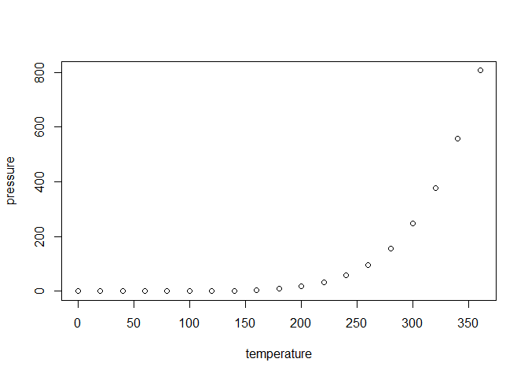

## GitHub Documents

## Including Code

You can include R code in the document as follows:

## Including Plots

You can also embed plots, for example:

Note that the `echo = FALSE` parameter was added to the code chunk to
prevent printing of the R code that generated the plot.
